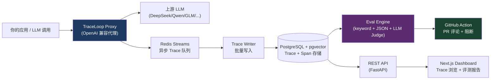

# TraceLoop CI

> 给中文 LLM 应用用的回归测试门禁 — 改 prompt、换模型、更新知识库后，PR 阶段自动跑回归，质量退化直接阻断。


---

改了 prompt、换了模型、更新了知识库，上线后才发现回答质量崩了？传统单元测试测不了大模型输出，TraceLoop 帮你在 PR 阶段就抓出质量退化。

## 它做什么

1. 无侵入代理记录所有 LLM 调用，沉淀为 Trace 数据
2. 从真实流量里一键生成黄金测试集，支持多维度自动化评测
3. 接入 GitHub CI，PR 改动自动跑回归，质量下降直接阻断合并

Mock LLM 服务内置，不用任何 API Key 就能跑通全流程。想真正评测的话，配置一个 DeepSeek/Qwen/GLM 的 API Key 就行。

## 它不做什么

- **不是全量 LLMOps 平台**。不做用户分群、用量计费、Prompt 管理这些事
- **不是通用评测框架**。只聚焦 CI 回归检测，不做复杂的实验设计或模型对比
- **不替代 LiteLLM/OneAPI 这类网关**。对接现有网关，只做采集和评测
- **不对标生产级网关的高可用**。主打中小团队的开发测试环境，不是给百万 QPS 设计的

## 适合谁

做中文 LLM 应用的中小团队、独立开发者、在校项目。用 DeepSeek/Qwen/GLM 等国内模型，需要保证迭代中回答质量不退化的。

不适合：做大模型竞技场评测的、需要企业级高可用的、主要用英文模型的应用。

## 30 秒跑起来

```bash
git clone https://github.com/kpto1/TraceLoopCI.git
cd TraceLoopCI
docker compose up -d
# 等 10 秒等数据库初始化完
open http://localhost:3000
```

首次启动自动建表。内置 Mock LLM 服务，不用真实 API Key 就能看到 Trace 列表和评测流程。

## 核心功能

### 无侵入 Trace 采集

- OpenAI 格式兼容：改一下 endpoint 指向 `http://localhost:8000/proxy/v1/chat/completions`，业务代码零改动
- 双重写入：同步写入 + Redis Stream 异步消费，API 请求不阻塞
- 流式/非流式都支持：流式场景逐 chunk 转发并记录首 token 延迟
- 单条/批量写入 API 都提供

```python
# 就是这么简单
import httpx
resp = httpx.post("http://localhost:8000/v1/traces", json={
    "user_input": "退款政策是什么？",
    "model_output": "7天内可申请无理由退款。",
    "model": "deepseek-chat",
})
```

### 黄金测试集管理

从历史 Trace 一键保存为测试用例，不需要手写构造数据。

```bash
# 从 trace_id 生成测试用例
curl -X POST http://localhost:8000/v1/datasets/1/cases/from-trace/{trace_id} \
  -H "Content-Type: application/json" \
  -d '{"expected_keywords": ["退款", "7天"], "forbidden_keywords": ["不能退款"]}'
```

每个测试用例支持：
- **expected_keywords**：回答里必须出现的关键词
- **forbidden_keywords**：出现就算违规的禁止词
- **expected_json_schema**：强制输出为 JSON 并校验结构
- **must_cite_docs**：必须引用指定文档

### 多维度自动化评测

跑一个 eval run，输出三项结果：

| 维度 | 方法 | 说明 |
|------|------|------|
| 关键词断言 | 字符串匹配 | expected 都出现 + forbidden 没出现 = 通过 |
| JSON Schema | jsonschema 校验 | 输出能否正确解析为 JSON，是否符合 schema |
| LLM-as-Judge | 裁判模型打分 | 用 DeepSeek/Qwen/GLM 做语义评分（0-10），>=6 通过 |

同时记录成本变化（和基准线比）、P95 延迟、格式合规率。裁判模型不开 API Key 时自动降级为启发式评分，不阻塞流程。

### PR 质量门禁

GitHub Action 一键接入。PR 创建时自动跑全量测试用例，结果贴在 PR 评论里。

```yaml
# .github/workflows/traceloop-eval.yml — 已经配好了，改 secrets 就能用
```

评分逻辑：
- >= 90 分：绿色通过
- 80-89 分：黄色警告
- < 80 分：红色阻断，PR 合不进去

失败用例会列出 input 和错误原因，方便定位问题。

### 中文原生适配

- 裁判 LLM Prompt 针对中文语义优化过，不是翻译的英文模板
- Mock LLM 内置中文客服关键词（退款、会员、订单等）
- 内置客服和电商场景模板可以直接套

## 架构



数据流：你的应用发出 LLM 请求 -> Proxy 拦截并转发 -> 真实响应返回给应用 -> Trace 异步写入 PostgreSQL -> Eval Engine 读取用例并评测 -> 结果通过 API 展示或推送到 GitHub PR。

## 竞品对比

| 维度 | TraceLoop CI | eval-view | Langfuse | promptfoo |
|------|-------------|-----------|----------|-----------|
| 核心定位 | CI 回归门禁 | LLM 评测 | LLM 可观测性 | Prompt 测试 |
| 中文生态 | 原生，裁判 prompt 和 Mock 数据都是中文 | 英文优先 | 英文优先，有中文 UI | 英文优先 |
| 接入成本 | 改 endpoint + docker compose | 需要集成 SDK | 需要埋点 SDK | 需要配置 prompt 文件 |
| 网关/代理能力 | 有，可拦截记录流量 | 无 | 无 | 无 |
| 黄金测试集 | 支持，可从 Trace 一键生成 | 不支持 | 不支持 | 支持，手写 |
| LLM-as-Judge | DeepSeek/Qwen/GLM | OpenAI 为主 | OpenAI 为主 | 多模型 |
| PR 门禁 | GitHub Action 内置 | 有，但配置复杂 | 无 | 通过 CLI 实现 |
| 部署方式 | docker compose | docker compose | 托管 | npm 包 |

说明：promptfoo 在 prompt 工程场景很强，但它是 CLI 工具，不是服务。Langfuse 做观测追踪很好，但评测不是它的核心功能。TraceLoop 选了一个窄切口：只做 CI 回归阻断，中文场景优化到底。

## 本地开发

### 环境要求

- Python 3.12+
- Node 18+ (pnpm 推荐)
- Docker Desktop（跑 PostgreSQL 和 Redis）
- 或者直接全部用 Docker 跑

### 步骤

```bash
# 1. 克隆
git clone https://github.com/你的用户名/TraceLoopCI.git
cd TraceLoopCI

# 2. 启动依赖服务（数据库 + Redis）
docker compose up -d postgres redis

# 3. Python 虚拟环境
python -m venv venv
source venv/bin/activate
# Windows: venv\Scripts\activate

# 4. 安装依赖
pip install -r requirements.txt

# 5. 启动后端
uvicorn app.main:app --reload --port 8000

# 6. 新终端，启动前端
cd frontend
pnpm install
pnpm dev

# 7. 浏览器打开
open http://localhost:3000
```

### 常用命令

```bash
# 跑测试
pytest tests/ -v                           # 跑所有测试
pytest tests/ --cov=app --cov-report=term   # 带覆盖率
pytest tests/ -k "keyword"                  # 只跑某个模块

# Docker
docker compose up -d --build                # 重新构建启动
docker compose down -v                      # 停止并清理数据
docker compose logs -f api                  # 看后端日志

# 数据库
docker compose exec postgres psql -U traceloop -d traceloop  # 直接连数据库

# Mock LLM 测试
curl http://localhost:9876/v1/chat/completions \
  -H "Content-Type: application/json" \
  -d '{"model":"mock","messages":[{"role":"user","content":"退款怎么退？"}],"stream":false}'
```

### SDK

Python SDK（pytest 插件）：

```bash
cd sdk/python
pip install -e .
pytest --traceloop-url=http://localhost:8000 --traceloop-key=your-key your_tests.py
```

TypeScript SDK：

```typescript
import { configure, recordTrace } from 'trace-loop-ci';

configure({ apiUrl: 'http://localhost:8000', apiKey: 'your-key' });

const output = await callYourLLM("退款政策是什么？");
await recordTrace("退款政策是什么？", output, "deepseek-chat");
```

也支持装饰器模式自动记录：

```typescript
import { traceLoop } from 'trace-loop-ci';

class MyService {
  @traceLoop("deepseek-chat")
  async handleQuery(input: string) {
    // LLM 调用
    return result;
  }
}
```

## 常见坑 & 已知限制

1. **Windows Docker 端口冲突**：本地 PostgreSQL 默认 5432，和容器冲突。改 `docker-compose.yml` 里 postgres 的端口映射，或者停本地服务
2. **Docker Desktop 未启动**：Windows 上需确保 Docker Desktop 正在运行（系统托盘显示鲸鱼图标），否则 `docker compose` 会报 "failed to connect to the docker API"
3. **Windows Git Bash + curl 中文编码**：Git Bash 的 `curl` 发送中文 JSON body 时可能被编码为 GBK 而非 UTF-8，导致 Mock LLM 返回 `UnicodeDecodeError`。建议使用 Python `httpx` 或 Postman 测试中文接口
4. **流式代理在 Nginx 后缓冲**：如果前面挂了 Nginx，记得加 `proxy_buffering off;` 和 `proxy_cache off;`，否则 stream 会在 Nginx 那卡住
5. **LLM-as-Judge 打分有波动**：裁判模型打分不是绝对稳定的，建议设阈值（比如 >=6/10 算通过），不要和基线分数严格比较
6. **只支持 OpenAI 兼容格式**：非标准协议的模型（比如某些自建 API）需要自己写适配层。OpenAI 格式的都能接
7. **单机部署够用**：万级日调用量没问题。再往上建议分片部署：多个 collector -> 同一个 Redis + PostgreSQL
8. **评测跑得慢**：每个 case 都调一次 LLM，100 个 case 就要调 100 次。建议把基准线结果缓存起来，PR 只对比 diff
9. **Mock LLM 极简**：内置 mock 只有关键词匹配，不支持复杂对话逻辑。要测试真实场景就配真 API Key

## 路线图

- [x] Trace 采集代理（流式 + 非流式）
- [x] Golden Dataset 构建器
- [x] 关键词 / JSON Schema / LLM-as-Judge 评测器
- [x] Next.js Dashboard
- [x] GitHub Action PR 门禁
- [x] Python SDK（pytest 插件）
- [x] TypeScript SDK
- [ ] Grafana + Prometheus 集成
- [ ] 评测引擎插件化（支持自定义 evaluator）
- [ ] 多模态评测支持
- [ ] Kubernetes Helm Chart
- [ ] 基线对比报告自动生成
- [ ] 更多评测维度（事实一致性、幻觉检测）

## 贡献

提 Issue 和 PR 都欢迎。大的改动建议先开 Issue 讨论，不要直接甩大 PR。

开发前先跑 `pytest tests/ -v` 确保现有测试全绿。新功能带测试。

## 协议

MIT

## 致谢

- [Ragas](https://github.com/explodinggradients/ragas) — LLM 评测方法论参考
- [eval-view](https://github.com/your-org/eval-view) — CI 门禁思路启发
- [Langfuse](https://github.com/langfuse/langfuse) — Trace 数据模型参考
- [promptfoo](https://github.com/promptfoo/promptfoo) — LLM 评测领域实践验证

---

## English Summary

TraceLoop CI is a behavioral regression testing platform for LLM applications, built with native support for the Chinese AI ecosystem (DeepSeek, Qwen, GLM).

**What it does:**
- Non-invasive trace collection via an OpenAI-compatible proxy endpoint. Point your LLM calls to `/proxy/v1/chat/completions`, and it records every request/response automatically — zero code changes.
- Golden dataset builder: promote real traffic traces into test cases with expected keywords, forbidden keywords, and JSON schema validations.
- Multi-dimensional automated evaluation: keyword assertion, JSON schema validation, and LLM-as-Judge scoring (supports DeepSeek, Qwen, GLM as judge models).
- GitHub PR quality gate: automated regression runs on every PR, results posted as PR comments, blocks merge if quality drops below threshold (80%).

**Quick start:**
```bash
docker compose up -d
# Open http://localhost:3000
```

**Architecture:** App -> Proxy (OpenAI-compatible) -> Redis Streams -> PostgreSQL (with pgvector) -> Eval Engine (keyword/JSON/LLM-Judge) -> Dashboard + GitHub PR Comment.

**Why this exists:** Traditional unit tests can't validate LLM outputs. After changing prompts, swapping models, or updating knowledge bases, there was no way to catch regressions before production. TraceLoop CI fills that gap specifically for teams working with Chinese LLMs.

**Components:**
- FastAPI backend with async SQLAlchemy, Redis streams for trace ingestion
- Next.js 16 dashboard for trace browsing and eval reports
- Python SDK (pytest plugin) and TypeScript SDK for programmatic trace recording
- Three evaluators: keyword assertion, JSON schema validation, LLM-as-Judge
- GitHub Action for PR gating
- Docker Compose for local development (PostgreSQL + pgvector, Redis, API, Mock LLM)

**Known limits:** Single-node deployment only; OpenAI-compatible endpoints only; judge model scoring has inherent variance; eval runs are sequential per case (slow on large datasets). Not an LLMOps platform, not a replacement for LiteLLM/OneAPI.

**License:** MIT

Full documentation in Chinese. English docs are in progress.
